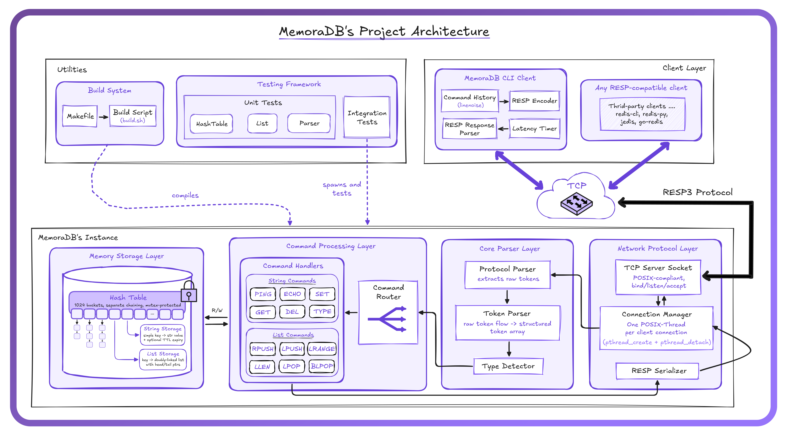
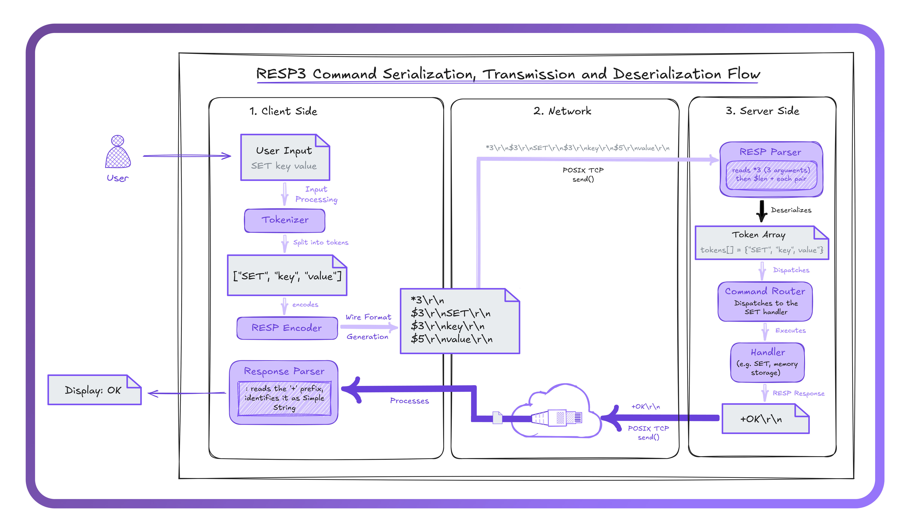
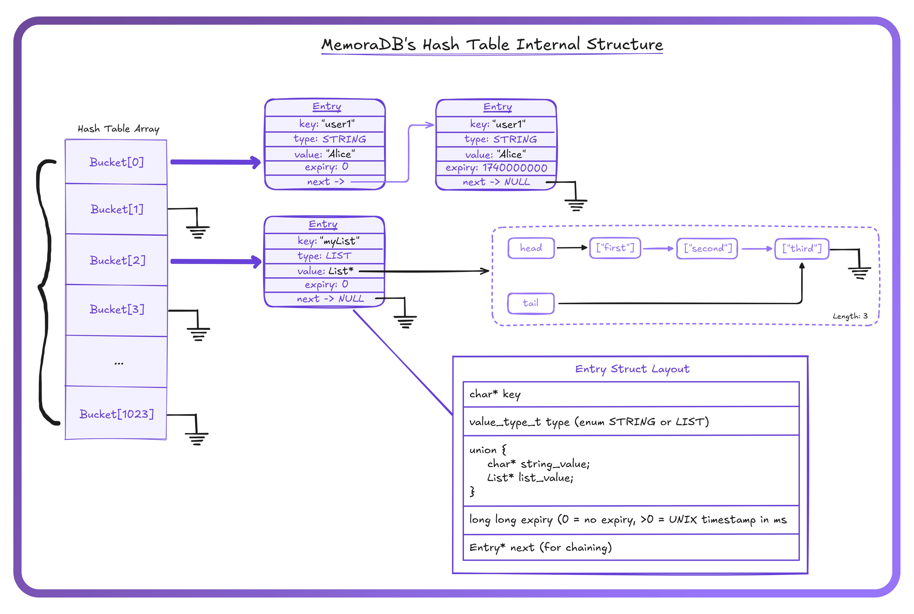
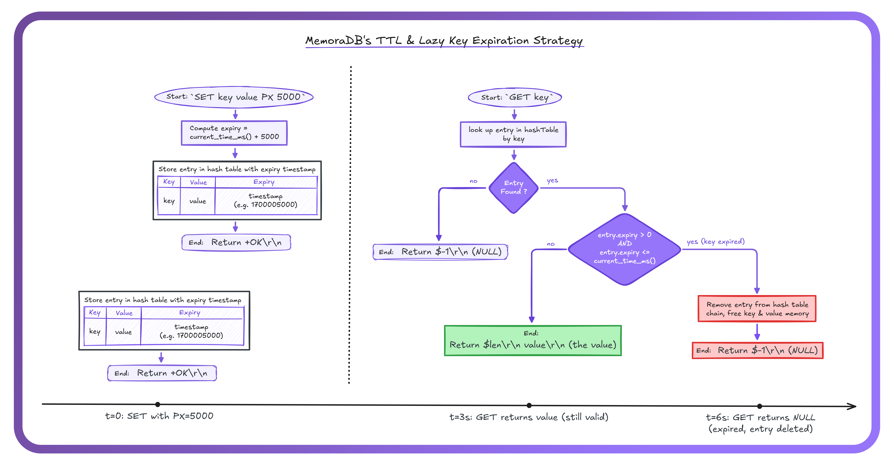

# MemoraDB

### Overview

MemoraDB is an ultra-low-latency, **<ins>in-memory key-value database</ins>** engineered for applications where speed, reliability, and simplicity are paramount. Built in C with a focus on modern system design, MemoraDB leverages efficient data structures, atomic operations, and robust multi-threading to deliver microsecond-level performance.

MemoraDB is designed to be a _standalone_ in-memory database with all its client forms, but we decided to make it also fully compliant with the **RESP3 protocol**, meaning it can serve as a drop-in replacement for Redis in many use cases and is compatible with any modern Redis/RESP client, CLI, and tool.

> Developed & Maintained by [The HaiKaw Pr0tocol](https://github.com/The-HaiKaw-Pr0tocol) organization.

## MemoraDB's Logo

<div align="center">
    
</div>

## Authors

<div align="center">

<table>
  <tr>
    <td align="center">
        <br />
        <b>Kawtar Taik</b> <br />
            
            <span>
                <a href="https://github.com/kei077"></a>
            </span>
            <br /> <br />
            <a href="https://github.com/kei077" title="GitHub">
                
            </a>
            <a href="https://www.linkedin.com/in/kawtar-ta%C3%AFk-7544a11b9/" 
            title="LinkedIn">
                
            </a>
            <a href="mailto:kawtartaik123@gmail.com" 
            title="Email">
                
            </a>
      <br />
    </td>
    <td align="center">
        <br />
        <b>Haitam Bidiouane</b> <br />
            
            <span>
                <a href="https://github.com/sch0penheimer"></a>
            </span>
            <br /> <br />
            <a href="https://github.com/sch0penheimer" title="GitHub">
                
            </a>
            <a href="https://www.linkedin.com/in/haitam-bidiouane" 
            title="LinkedIn">
                
            </a>
            <a href="mailto:h.bidiouane@gmail.com"
            title="Email">
                
            </a>
      <br />
    </td>
  </tr>
</table>

</div>

---

## Maintainers

<div align="center">

|                                                                                           GitHub Profile                                                                                            | Name             | Usernames                                                                                                                                                                                                                                      |
| :-------------------------------------------------------------------------------------------------------------------------------------------------------------------------------------------------: | ---------------- | ---------------------------------------------------------------------------------------------------------------------------------------------------------------------------------------------------------------------------------------------- |
|                                <a href="https://github.com/kei077"></a>                                 | Kawtar Taik      |  <a href="https://github.com/kei077"></a>               |
| <a href="https://github.com/sch0penheimer"></a> | Haitam Bidiouane |  <a href="https://github.com/sch0penheimer"></a> |

</div>

---

## Contributors

<table>
<tr>
<td align="center">
  <a href="https://github.com/kei077">
    
  </a>
  <br>
  <a href="https://github.com/kei077" title="GitHub">
    
  </a>
</td>
<td align="center">
  <a href="https://github.com/sch0penheimer">
    
  </a>
  <br>
  <a href="https://github.com/sch0penheimer" title="GitHub">
    
  </a>
</td>
<td align="center">
  <a href="https://github.com/FlawlessAw">
    
  </a>
  <br>
  <a href="https://github.com/FlawlessAw" title="GitHub">
    
  </a>
</td>
<td align="center">
  <a href="https://github.com/Pouzani">
    
  </a>
  <br>
  <a href="https://github.com/Pouzani" title="GitHub">
    
  </a>
</td>
<td align="center">
  <a href="https://github.com/shady0503">
    
  </a>
  <br>
  <a href="https://github.com/shady0503" title="GitHub">
    
  </a>
</td>
<td align="center">
  <a href="https://github.com/MossabArektout">
    
  </a>
  <br>
  <a href="https://github.com/MossabArektout" title="GitHub">
    
  </a>
</td>
<td align="center">
  <a href="https://github.com/youssefbouraoui1">
    
  </a>
  <br>
  <a href="https://github.com/youssefbouraoui1" title="GitHub">
    
  </a>
</td>
</tr>
</table>

## Table of Contents

1. [MemoraDB's Architecture](#1-memoradbs-architecture)
   - [System Overview](#11-system-overview)
   - [Design Constraints](#12-design-constraints)
2. [RESP3 Protocol](#2-resp3-protocol)
   - [Wire Format](#21-wire-format)
   - [Supported Types](#22-supported-types)
   - [Command Reference](#23-command-reference)
3. [Server Internals](#3-server-internals)
   - [Connection Handling](#31-connection-handling)
   - [Command Pipeline](#32-command-pipeline)
   - [Concurrency Model](#33-concurrency-model)
4. [Storage Engine](#4-storage-engine)
   - [Hash Table](#41-hash-table)
   - [Linked Lists](#42-linked-lists)
   - [Key Expiry (TTL)](#43-key-expiry-ttl)
5. [Client](#5-client)
   - [CLI Usage](#51-cli-usage)
   - [Example Session](#52-example-session)
6. [Build & Test](#6-build--test)
   - [Requirements](#61-requirements)
   - [Build Targets](#62-build-targets)
   - [Docker](#63-docker)
   - [Test Suite](#64-test-suite)

---

7. [Contributing](#7-contributing)

<br />

## 1. Architecture

### 1.1 System Overview

<div align="center">
  
  <br/>
  <i>Figure 1: MemoraDB system architecture : Layered decomposition from network I/O through protocol parsing, storage, and shared utilities.</i>
</div>

> [!IMPORTANT]
> This represents our current architectural vision for MemoraDB. As development progresses, this design may evolve based on implementation discoveries.

<br />

MemoraDB is organized into four layers, each with a single responsibility:

| **_Network layer_** : `server.c` and raw POSIX sockets. This is the outermost boundary of the process: it owns the TCP accept loop, spawns one `pthread_create` per inbound connection, and performs all `recv()` / `send()` I/O. Nothing above this layer ever touches a file descriptor directly.

| **_Protocol layer_** : `parser.c` (server-side) and `resp_parser.c` (client-side). Inbound bytes are deserialized from RESP wire format into a flat token array; outbound responses are serialized back into RESP before being handed to the network layer. The two parsers are independent compilation units and share no state.

| **_Storage layer_** : `hashTable.c` and `list.c`. All persistent (in-memory) state lives here: a fixed-size hash table of 1024 buckets with separate chaining, and singly-linked lists for the `LIST` data type. TTL bookkeeping is co-located with the entries themselves.

| **_Utilities layer_** : `log.c` (leveled logging), `logo.c` (startup banner), and the bundled `linenoise.c` line-editing library. These are leaf dependencies, they are consumed by upper layers but depend on nothing in the project.

The end-to-end data flow is: **socket → RESP decode → tokenize → dispatch → storage op → RESP encode → socket**.

### 1.2 Design Constraints

MemoraDB is deliberately narrow in scope. Every design decision favors **simplicity and auditability** over feature breadth: the codebase should be small enough that a single engineer can hold the entire system in their head. The constraints below are intentional trade-offs, not oversights; each one eliminates a class of complexity at the cost of a well-understood limitation.

<div align="center">

| Constraint                         | Detail                                                                                                                           |
| ---------------------------------- | -------------------------------------------------------------------------------------------------------------------------------- |
| **Zero third-party dependencies**  | Only libc, POSIX, and `-lpthread`. No package manager, no vendored libs beyond bundled linenoise.                                |
| **POSIX-only**                     | Uses `<sys/socket.h>`, `<pthread.h>`, `<unistd.h>`, `<arpa/inet.h>`. Not portable to native Win32 without a compatibility layer. |
| **Single-process, multi-threaded** | One `pthread_create` per accepted connection. No fork, no event loop (epoll/kqueue).                                             |
| **Fixed-size hash table**          | `TABLE_SIZE = 1024` buckets, separate chaining. No dynamic resizing at runtime.                                                  |
| **Lazy expiry**                    | Keys with a TTL are evicted on access (`get_value` checks `current_millis()`), not by a background reaper.                       |

</div>

---

## 2. RESP Protocol

MemoraDB implements the **RESP** (REdis Serialization Protocol) wire format, making it compatible with `redis-cli`, client libraries in every major language, and any tool that speaks RESP.

### 2.1 Wire Format

<div align="center">
  
  <br/>
  <i>Figure 2: RESP wire lifecycle : Encoding on the client side, byte transmission over TCP, and decoding on the server side.</i>
</div>

<br />

Every RESP message is a sequence of bytes terminated by `\r\n`. The first byte identifies the type:

<div align="center">

| Prefix | Type          | Example (wire bytes)               |
| ------ | ------------- | ---------------------------------- |
| `+`    | Simple String | `+OK\r\n`                          |
| `-`    | Error         | `-ERR unknown command\r\n`         |
| `:`    | Integer       | `:42\r\n`                          |
| `$`    | Bulk String   | `$5\r\nhello\r\n`                  |
| `$-1`  | Null Bulk     | `$-1\r\n`                          |
| `*`    | Array         | `*2\r\n$3\r\nfoo\r\n$3\r\nbar\r\n` |

</div>

Clients send commands as RESP arrays of bulk strings. The server responds with the appropriate RESP type per command.

### 2.2 Supported Types

The server-side parser (`parser.c`) handles inbound RESP arrays. The client-side parser (`resp_parser.c`) decodes all five response types into a `resp_object_t` union:

```c
typedef enum {
    RESP_SIMPLE_STRING,    /* '+' */
    RESP_ERROR,            /* '-' */
    RESP_INTEGER,          /* ':' */
    RESP_BULK_STRING,      /* '$' */
    RESP_ARRAY,            /* '*' */
    RESP_NULL,            /* '$-1' */
    RESP_UNKNOWN
} resp_type_t;
```

### 2.3 Command Reference

All commands below are implemented and tested. RESP encoding/decoding is handled transparently, any RESP-compatible client can issue these commands.

<div align="center">

| Command  | Syntax                        | Response Type       | Description                                                              |
| -------- | ----------------------------- | ------------------- | ------------------------------------------------------------------------ |
| `PING`   | `PING`                        | Simple String       | Returns `+PONG\r\n`. Health check.                                       |
| `ECHO`   | `ECHO <msg>`                  | Bulk String         | Returns the message verbatim.                                            |
| `SET`    | `SET <key> <val> [PX ms]`     | Simple String       | Stores `key → val`. Optional `PX` sets TTL in milliseconds.              |
| `GET`    | `GET <key>`                   | Bulk String / Null  | Returns value or `$-1\r\n` if missing/expired.                           |
| `DEL`    | `DEL <key> [key …]`           | Integer             | Returns count of keys actually deleted.                                  |
| `TYPE`   | `TYPE <key>`                  | Simple String       | Returns `string`, `list`, or `none`.                                     |
| `RPUSH`  | `RPUSH <key> <val> [val …]`   | Integer             | Appends to tail. Returns new list length.                                |
| `LPUSH`  | `LPUSH <key> <val> [val …]`   | Integer             | Prepends to head. Returns new list length.                               |
| `LRANGE` | `LRANGE <key> <start> <stop>` | Array               | Returns elements in `[start, stop]`. Negative indices supported.         |
| `LLEN`   | `LLEN <key>`                  | Integer             | Returns list length, or `0` if key missing.                              |
| `LPOP`   | `LPOP <key> [count]`          | Bulk String / Array | Pops from head. With `count`, returns an array.                          |
| `BLPOP`  | `BLPOP <key> <timeout>`       | Array / Null        | Blocking pop. `timeout=0` blocks indefinitely. Returns `[key, element]`. |

</div>

> [!IMPORTANT]
> This table also reflects the current implementation. MemoraDB is under active development, additional commands will land before the first stable release.

---

## 3. Server Internals

### 3.1 Connection Handling

On startup, the server creates a TCP socket, binds it to `0.0.0.0:DEFAULT_PORT` (`6379`), and enters a blocking `listen()` with a backlog depth of `CONNECTION_BACKLOG` (5). From that point on, the main thread does nothing but **accept**.

Every successful `accept()` heap-allocates a `ClientContext` that carries the client's file descriptor, remote IP, and port:

```c
typedef struct {
    int   client_fd;
    char  ip_address[16];
    int   port;
} ClientContext;
```

A **detached pthread** is then spawned via `pthread_create` + `pthread_detach`, running `handle_client()`. Ownership of the `ClientContext` transfers to the new thread, it is responsible for calling `free()` before returning. The main thread never touches the struct again.

**Graceful shutdown** is handled by a `SIGINT` / `SIGTERM` signal handler that flips the `volatile int server_running` flag to `0`. The accept loop tests this flag on every iteration and breaks out cleanly, closing the listening socket on its way down.

### 3.2 Command Pipeline

Inside each client thread, every iteration of the read loop follows a strict four-stage pipeline:

```
recv(client_fd, buffer, BUFFER_SIZE)
        │
        ▼
parse_command(buffer, tokens[], MAX_TOKENS)   ← RESP array → token list
        │
        ▼
identify_command(tokens[0])                   ← returns command_t enum
        │
        ▼
dispatch_command(client_fd, tokens, count)    ← executes + writes RESP response
```

- **Stage 1: <ins>Read.</ins>** A blocking `recv()` fills a stack-allocated `buffer[BUFFER_SIZE]` (1 024 bytes). No buffering or reassembly across calls, one `recv` maps to one command.

- **Stage 2: <ins>Parse.</ins>** `parse_command()` walks the RESP array header (`*N\r\n`) and extracts each bulk-string payload into a flat `char *tokens[]` array, up to `MAX_TOKENS` (16) entries.

- **Stage 3: <ins>Identify.</ins>** `identify_command(tokens[0])` performs a case-insensitive match against the supported command set and returns a `command_t` enum value (`CMD_PING`, `CMD_SET`, …, `CMD_UNKNOWN`).

- **Stage 4: <ins>Dispatch.</ins>** `dispatch_command()` switches on that enum and calls directly into the storage layer: `set_value`, `get_value`, `delete_key`, the list operations, etc. The RESP-encoded response is written back to the client socket within the same function.

### 3.3 Concurrency Model

MemoraDB follows a **thread-per-connection** model. There is no connection pooling, no event-driven multiplexing, and no pre-forked worker pool. Each client gets its own stack, its own `buffer[]`, and its own execution context.

The global hash table `HASHTABLE[TABLE_SIZE]` is guarded by a **single `pthread_mutex_t`**. This is _not_ a per-bucket lock: every read or write to the store acquires the same mutex, holds it for the duration of the operation (including any `malloc` / `free` inside), and releases it on return. The design prioritizes correctness and simplicity over throughput.

**Blocking operations** deserve special mention. `BLPOP` puts the calling thread into a `pthread_cond_timedwait` loop: it releases the global mutex, sleeps until a condition variable is signaled (by an `LPUSH` / `RPUSH` on the same key) or the timeout elapses, then reacquires the mutex before returning.

> [!NOTE] 
> The single-mutex design is correct but serializes all storage access. Under high concurrency this becomes a bottleneck. Per-bucket or striped locking is a planned improvement.

---

## 4. Storage Engine

### 4.1 Hash Table

<div align="center">
  
  <br/>
  <i>Figure 3: Hash table memory layout : A fixed 1024-bucket array with separate-chaining entries and a polymorphic value union.</i>
</div>

<<<<<<< HEAD
<br/>

=======
>>>>>>> f9b265bfe6b5e09765e4614395748d1c990aa761
The primary data store is a statically-sized, open-addressed hash table defined in `hashTable.c`. The top-level symbol is a plain C array of entry pointers:

```c
Entry *HASHTABLE[TABLE_SIZE];
```

Each slot points to the head of a singly-linked collision chain. Entries are heap-allocated and prepended on insertion:

```c
typedef struct Entry {
    char          *key;
    value_type_t   type;
    union {
        char *string_value;
        List *list_value;
    } data;
    long long      expiry;
    struct Entry  *next;
} Entry;
```

**Hashing.** The `hash()` function computes an unsigned integer from the key string and reduces it with `% TABLE_SIZE`. The result is a bucket index into `HASHTABLE[]`. Because the table is never resized, the bucket count is fixed for the lifetime of the process.

**Polymorphic values.** Every `Entry` carries a `value_type_t` tag, either `VALUE_STRING` or `VALUE_LIST`, alongside a C `union` that holds the actual payload. String keys store a heap-allocated `char *`; list keys store a pointer to a `List` struct. The tag is checked before every access, and the `TYPE` command exposes it to clients as `"string"`, `"list"`, or `"none"`.

### 4.2 Linked Lists

List-type values are backed by a **singly-linked list** with explicit head _and_ tail pointers, plus a cached length counter:

```c
typedef struct ListNode {
    char            *value;
    struct ListNode *next;
} ListNode;

typedef struct List {
    ListNode *head;
    ListNode *tail;
    size_t    length;
} List;
```

The dual-pointer design keeps both **push-right** (`list_rpush`, append at tail) and **push-left** (`list_lpush`, prepend at head) at **_O(1)_**. Popping from the head (`lpop_element`) is also **_O(1)_** since it only needs to advance the head pointer and free the old node.

`lpop_multiple(list, n)` iterates _n_ times and is therefore **_O(N)_**. `list_range(list, start, end)` walks from the head to the _start_ index and then copies elements through _end_, yielding **_O(start + count)_**.

The `length` field is maintained incrementally by every push and pop, so `list_length()`, and by extension the `LLEN` command, returns in **_O(1)_** without traversal.

### 4.3 Key Expiry (TTL)

<div align="center">
  
  <br/>
  <i>Figure 4: Lazy TTL expiration : Expired keys are evicted at read time rather than by a background sweep thread.</i>
</div>

<<<<<<< HEAD
<br/>

=======
>>>>>>> f9b265bfe6b5e09765e4614395748d1c990aa761
When a client issues `SET key value PX <ms>`, the server computes `expiry = current_millis() + ms` and stores it in the `Entry`'s `expiry` field. A value of `0` means "no TTL : Live Forever."

Expiry is **lazy**: there is no dedicated reaper thread, no periodic scan, and no timer wheel. Instead, every access path checks the clock:

1. `get_value(key)` reads `entry->expiry` and compares it to `current_millis()`. If the deadline has passed, it removes the entry from the chain, frees all associated memory, and returns `NULL`, as if the key never existed.
2. `delete_key()` performs the same staleness check before attempting deletion.
3. List operations (`get_list_if_exists`, `get_or_create_list`) apply the same guard.

**Trade-off.** Lazy eviction means zero background CPU cost, but stale keys occupy memory until something _reads_ them. Under write-heavy workloads with many short-lived keys, resident memory can grow well beyond the live dataset size. A background sampling eviction pass (similar to Redis's `activeExpireCycle`) is a planned future addition.

---

## 5. Client

### 5.1 CLI Usage

The bundled CLI client (`src/client/client.c`) connects to `127.0.0.1:6379` over TCP and provides:

- **Line editing** via the bundled linenoise library (arrow keys, Ctrl-A/E, etc.).
- **Persistent history** across sessions (`history.c`).
- **RESP response parsing**: raw RESP bytes are decoded into human-readable output by `parse_and_display_resp()`.

Type `exit` or press `Ctrl-C` to disconnect.

### 5.2 Example Session

```
$ ./client
Connected to MemoraDB server...

MemoraDB> PING
+PONG

MemoraDB> ECHO "Hello, MemoraDB!"
$16
Hello, MemoraDB!

MemoraDB> SET mykey myvalue
+OK

MemoraDB> GET mykey
$7
myvalue

MemoraDB> SET temp 42 PX 5000
+OK

MemoraDB> TYPE mykey
+string

MemoraDB> RPUSH mylist first second third
:3

MemoraDB> LRANGE mylist 0 -1
*3
$5
first
$6
second
$5
third

MemoraDB> LPOP mylist
$5
first

MemoraDB> LLEN mylist
:2

MemoraDB> DEL mykey
:1

MemoraDB> GET mykey
$-1

MemoraDB> exit
Connection closed.
```

---

## 6. Build & Test

### 6.1 Requirements

1. **Compiler** : GCC or Clang, C99 or later. Any POSIX-compliant C compiler that supports `-Wall -Wextra` will work; no GNU extensions are required.

2. **Build system** : GNU Make ≥ 3.81. The Makefile uses `$(shell find …)` for source discovery, which is a POSIX utility wrapped by Make.

3. **Operating system** : Any POSIX-compliant OS: Linux, macOS, FreeBSD, etc. There is no native Windows support; use WSL or a compatibility layer.

4. **Linker flags** : `-lpthread` is the only external flag and is added automatically by the Makefile.

**Third-party libraries** : _none_. The project compiles from a clean checkout with no downloads, no package manager, and no vendored code beyond the bundled linenoise.

### 6.2 Build Targets

```bash
make                  #- builds ./server and ./client (runs headers target first) -#
make test                   #- compiles all test binaries under tests/ -#
make run-tests             #- compiles and executes the full test suite -#
make headers      #- refreshes file-header doc/metadata (author, date) via build.sh -#
make clean               #- removes server, client, and all test binaries -#
```

The Makefile compiles every `.c` under `src/` (excluding `client.c` and `server.c` themselves) as shared object files linked into both executables:

```makefile
FILES := $(shell find src -type f -name '*.c' \
  ! -path '$(CLIENT_SRC)' \
  ! -path '$(SERVER_SRC)')
```

### 6.3 Docker

The Dockerfile builds the server binary inside the container and exposes port `6379`.

```bash
docker build -t memoradb .
docker run -p 6379:6379 memoradb
```

### 6.4 Test Suite

The custom test framework (`test_framework.c`) provides assertion macros, automatic pass/fail counting, and colored terminal output.

<div align="center">

| Test file            | Scope       | What it covers                                                                           |
| -------------------- | ----------- | ---------------------------------------------------------------------------------------- |
| `test_hashtable.c`   | Unit        | Insert, get, delete, overwrite, expiry, type detection                                   |
| `test_list.c`        | Unit        | rpush, lpush, lpop, lpop_multiple, lrange, edge cases                                    |
| `test_parser.c`      | Unit        | RESP tokenization, `identify_command()` for all `command_t` variants                     |
| `test_log.c`         | Unit        | Log level formatting and output                                                          |
| `test_history.c`     | Unit        | History file persistence                                                                 |
| `test_ping_echo.c`   | Integration | PING / ECHO over a real loopback socket (compiles with `-DTESTING` and links `server.c`) |
| `integration_test.c` | Integration | Multi-command sequences across components                                                |

</div>

```bash
make run-tests    #- compile + run everything, prints per-suite and final summary -#
```

---

## 7. Contributing

We welcome contributions to MemoraDB. Before opening a PR or issue, please review:

- [**Contributing Guide**](./CONTRIBUTING.md) : Code style, commit conventions, workflow.
- [**PR Template**](.github/PR_TEMPLATE.md) : Required sections for every pull request.
- [**Bug Report**](.github/ISSUE_TEMPLATE/bug_report.md) : Reproduction steps, expected vs. actual behavior.
- [**Feature Request**](.github/ISSUE_TEMPLATE/feature_request.md) : Mmotivation, proposed design.
- [**Discussions**](https://github.com/The-HaiKaw-Pr0tocol/MemoraDB/discussions) : Questions, design proposals, general Q&A.

<br />

---

> © 2025 The HaiKaw Protocol. All rights reserved.
